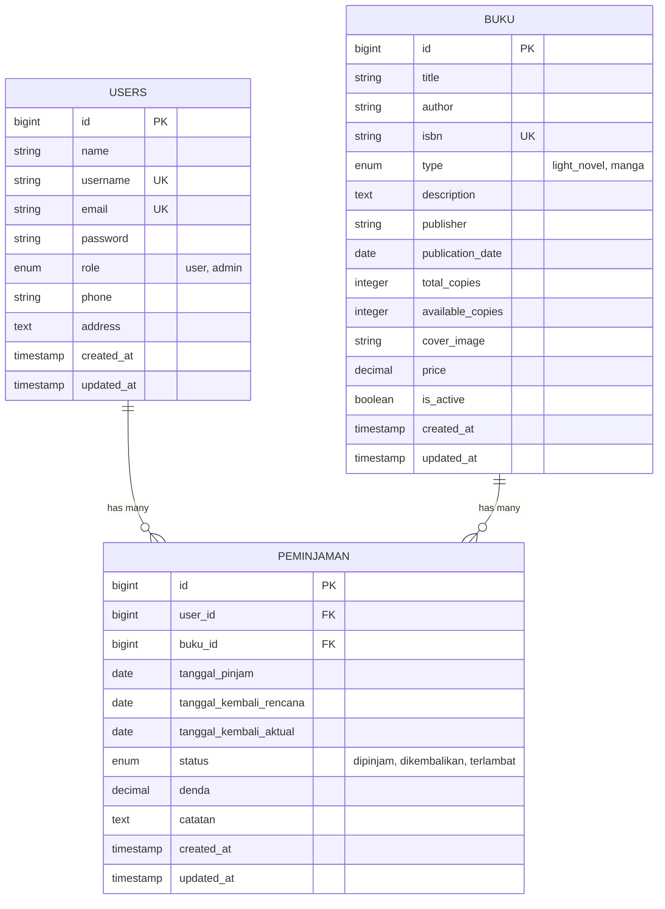
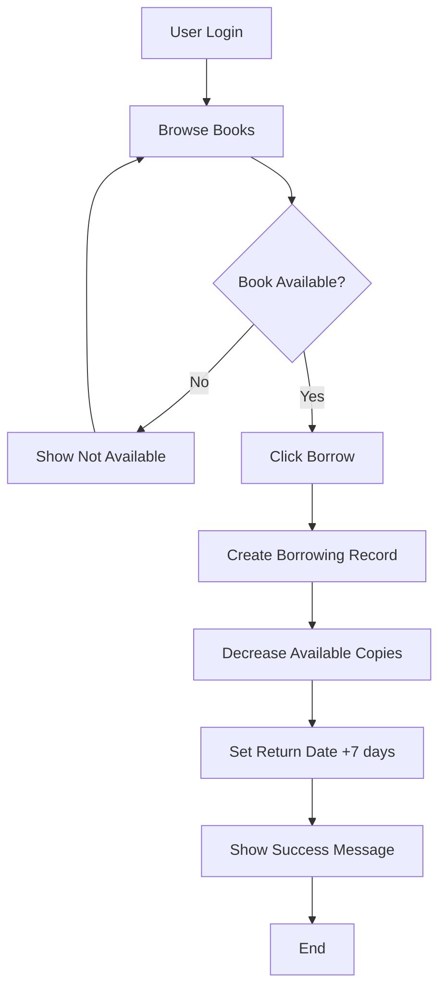
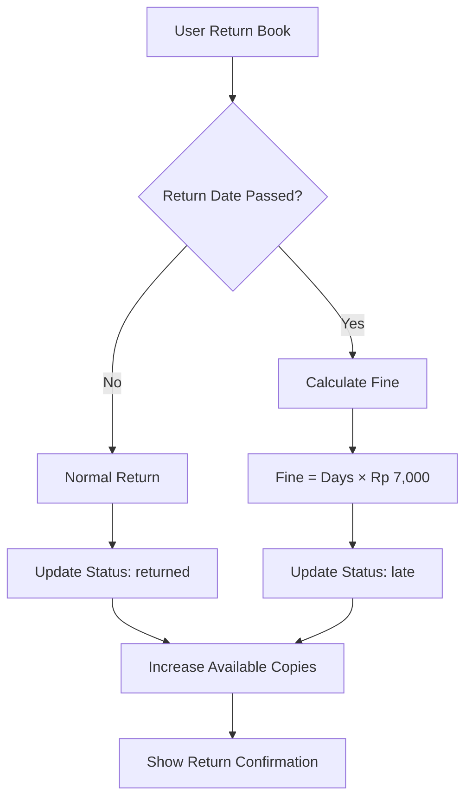

# 📚 Sistem Perpustakaan Digital

Sistem manajemen perpustakaan digital yang berfokus pada koleksi Light Novel dan Manga dengan fitur peminjaman, pengembalian, dan sistem denda otomatis.

## 📋 Daftar Isi

- [Deskripsi Proyek](#-deskripsi-proyek)
- [SDLC](#-software-development-life-cycle-sdlc)
- [ERD](#-entity-relationship-diagram-erd)
- [Flowchart](#-flowchart-sistem)
- [Fitur Utama](#-fitur-utama)
- [Teknologi](#-teknologi-yang-digunakan)
- [Instalasi](#-panduan-instalasi)
- [Penggunaan](#-penggunaan)
- [Database](#-struktur-database)
- [Kontribusi](#-kontribusi)

## 🎯 Deskripsi Proyek

Sistem perpustakaan digital yang dikembangkan untuk mengelola koleksi Light Novel dan Manga. Aplikasi ini memungkinkan admin mengelola buku dan peminjaman, sementara user dapat mencari, meminjam, dan mengembalikan buku secara mandiri.

### Tujuan Utama:
- ✅ Digitalisasi sistem perpustakaan
- ✅ Otomatisasi peminjaman dan pengembalian
- ✅ Sistem denda otomatis
- ✅ Interface berbahasa Indonesia
- ✅ Fokus pada Light Novel & Manga

## 🔄 Software Development Life Cycle (SDLC)

### Metodologi: **Agile Development**

#### 1. **Planning** (1 minggu)
- Analisis kebutuhan sistem perpustakaan
- Identifikasi stakeholder (Admin & User)
- Perencanaan fitur dan timeline

#### 2. **Design** (1 minggu)
- Perancangan database (ERD)
- Desain UI/UX wireframes
- Arsitektur sistem Laravel MVC

#### 3. **Implementation** (3 minggu)
- **Sprint 1**: Authentication & basic CRUD
- **Sprint 2**: Borrowing system & fine calculation
- **Sprint 3**: UI polishing & testing

#### 4. **Testing** (1 minggu)
- Unit testing untuk models & controllers
- Integration testing untuk complete workflows
- User acceptance testing

#### 5. **Deployment** (3 hari)
- Production server setup
- Database migration
- SSL & security configuration

#### 6. **Maintenance** (Ongoing)
- Bug fixes & feature updates
- Performance monitoring
- Security patches

## 🗄️ Entity Relationship Diagram (ERD)



## 📊 Flowchart Sistem

### Alur Peminjaman Buku



### Alur Pengembalian Buku



## ✨ Fitur Utama

### 👨‍💼 Admin Features
- **Dashboard**: Statistik sistem lengkap
- **Manajemen Buku**: CRUD buku dengan cover upload
- **Manajemen User**: Monitor semua pengguna
- **Peminjaman**: Create, monitor, dan process returns
- **Laporan**: Overdue tracking & fine reports

### 👤 User Features
- **Browse Buku**: Search & filter berdasarkan kategori
- **Peminjaman**: Self-service borrowing
- **My Borrowings**: Track active loans & history
- **Return Books**: Self-service returns
- **Profile**: Manage personal information

### 🔧 System Features
- **Authentication**: Role-based access (Admin/User)
- **Fine System**: Auto-calculate Rp 7,000/day
- **Responsive**: Mobile & desktop optimized
- **Security**: CSRF protection, input validation
- **Performance**: Optimized queries & caching

## 🛠 Teknologi yang Digunakan

### Backend
- **Framework**: Laravel 11
- **Language**: PHP 8.2+
- **Database**: MySQL 8.0+
- **Authentication**: Laravel Sanctum
- **Storage**: Laravel Storage

### Frontend
- **Template**: Blade Templates
- **Styling**: Tailwind CSS
- **JavaScript**: Vanilla JS
- **Icons**: Font Awesome

### Development Tools
- **Package Manager**: Composer
- **Build Tool**: Vite
- **Version Control**: Git
- **Testing**: PHPUnit

## 🚀 Panduan Instalasi

### Prerequisites
- PHP 8.2+
- Composer
- MySQL 8.0+
- Node.js & NPM

### Quick Start
```bash
# Clone repository
git clone https://github.com/your-repo/perpustakaan-bdl.git
cd perpustakaan-bdl

# Install dependencies
composer install
npm install

# Setup environment
cp .env.example .env
php artisan key:generate

# Configure database in .env file
DB_DATABASE=perpustakaan_bdl
DB_USERNAME=root
DB_PASSWORD=

# Run migrations & seed
php artisan migrate
php artisan db:seed

# Setup storage & assets
php artisan storage:link
npm run build

# Start server
php artisan serve
```

### Default Accounts
- **Admin**: username `admin`, password `password`
- **User**: username `takeshi`, password `password`

## 📖 Penggunaan

### Admin Workflow
1. Login dengan akun admin
2. Kelola buku di menu "Books"
3. Monitor peminjaman di "Borrowings"
4. Cek overdue di "Reports"
5. Process returns & fines

### User Workflow
1. Register/Login ke sistem
2. Browse & search buku
3. Pinjam buku yang tersedia
4. Monitor di "My Borrowings"
5. Return buku sebelum due date

### Aturan Peminjaman
- **Durasi**: 7 hari
- **Denda**: Rp 7,000/hari keterlambatan
- **Limit**: Sesuai ketersediaan buku

## 📊 Struktur Database

### Tabel Users
- `id`, `name`, `username`, `email`, `password`
- `role` (admin/user), `phone`, `address`
- `created_at`, `updated_at`

### Tabel Buku
- `id`, `title`, `author`, `isbn`
- `type` (light_novel/manga), `description`
- `publisher`, `publication_date`
- `total_copies`, `available_copies`
- `cover_image`, `price`, `is_active`

### Tabel Peminjaman
- `id`, `user_id`, `buku_id`
- `tanggal_pinjam`, `tanggal_kembali_rencana`
- `tanggal_kembali_aktual`, `status`
- `denda`, `catatan`

## 🤝 Kontribusi

1. Fork repository
2. Create feature branch (`git checkout -b feature/NewFeature`)
3. Commit changes (`git commit -m 'Add NewFeature'`)
4. Push to branch (`git push origin feature/NewFeature`)
5. Open Pull Request

## 📄 License

MIT License - lihat file [LICENSE](LICENSE) untuk detail.

---

<div align="center">

**📚 Sistem Perpustakaan Digital**

*Made with ❤️ using Laravel & Tailwind CSS*

[](https://laravel.com)
[](https://php.net)
[](https://mysql.com)

**© 2025 - Sistem Perpustakaan Digital**

</div>