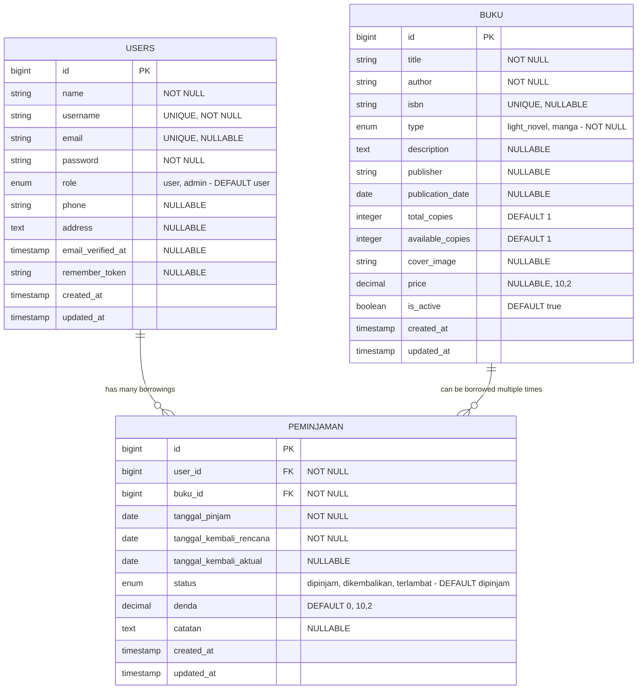
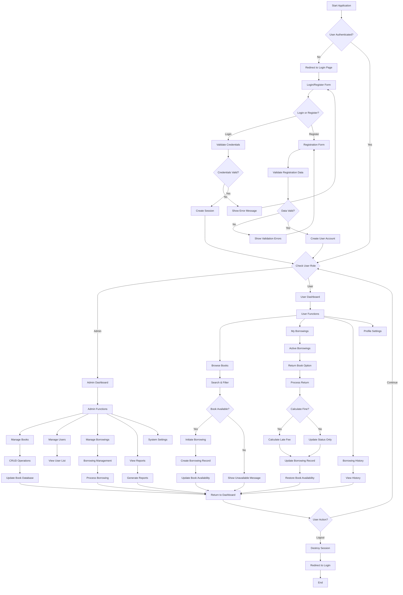

# 📚 Sistem Perpustakaan Digital

Sistem perpustakaan digital untuk mengelola koleksi buku, peminjaman, dan pengembalian dengan fokus pada Light Novel dan Manga.

## 📋 Daftar Isi

- [Deskripsi Proyek](#deskripsi-proyek)
- [Software Development Life Cycle (SDLC)](#software-development-life-cycle-sdlc)
- [Entity Relationship Diagram (ERD)](#entity-relationship-diagram-erd)
- [Flowchart Sistem](#flowchart-sistem)
- [Fitur Utama](#fitur-utama)
- [Teknologi yang Digunakan](#teknologi-yang-digunakan)
- [Panduan Instalasi](#panduan-instalasi)
- [Penggunaan](#penggunaan)
- [Struktur Database](#struktur-database)
- [Kontribusi](#kontribusi)

## 🎯 Deskripsi Proyek

Sistem Manajemen Perpustakaan ini dikembangkan khusus untuk mengelola koleksi Light Novel dan Manga Jepang. Sistem ini memungkinkan administrator untuk mengelola buku, pengguna, dan peminjaman, sementara pengguna reguler dapat mencari, meminjam, dan mengembalikan buku dengan mudah.

### Tujuan Proyek:
- Digitalisasi sistem perpustakaan tradisional
- Otomatisasi proses peminjaman dan pengembalian buku
- Sistem denda otomatis untuk keterlambatan
- Interface yang mudah digunakan dalam Bahasa Indonesia
- Fokus khusus pada literatur Jepang (Light Novel & Manga)

## 🔄 Software Development Life Cycle (SDLC)

Proyek ini dikembangkan menggunakan metodologi **Agile** dengan pendekatan iteratif untuk memastikan kualitas dan fleksibilitas dalam pengembangan.

### 1. **Planning & Analysis** 📋
**Durasi**: 1-2 Minggu

**Aktivitas**:
- **Requirement Gathering**: Identifikasi kebutuhan sistem perpustakaan digital
- **Stakeholder Analysis**: Analisis pengguna (Admin & Member)
- **Feasibility Study**: Evaluasi teknologi Laravel, MySQL, dan infrastruktur
- **Project Scope**: Penentuan batasan dan target sistem
- **Risk Assessment**: Identifikasi risiko teknis dan non-teknis

**Deliverables**:
- Dokumen System Requirement Specification (SRS)
- Project charter dan timeline
- Risk mitigation plan
- Resource allocation plan

### 2. **System Design** 🎨
**Durasi**: 1-2 Minggu

**Aktivitas**:
- **Architecture Design**: Desain arsitektur MVC dengan Laravel
- **Database Design**: Pembuatan ERD dan normalisasi database
- **UI/UX Design**: Wireframe dan prototype interface
- **API Design**: Perencanaan endpoint dan routing
- **Security Design**: Implementasi authentication dan authorization

**Deliverables**:
- System Architecture Diagram
- Entity Relationship Diagram (ERD)
- Database schema dan migration files
- UI/UX mockups dan prototypes
- API documentation

### 3. **Implementation** 💻
**Durasi**: 4-6 Minggu

#### **Sprint 1: Foundation** (Week 1-2)
- Setup Laravel project structure
- Database migration dan seeding
- Authentication system (Login/Register)
- Role-based access control
- Basic routing dan middleware

#### **Sprint 2: Core Features** (Week 3-4)
- CRUD operations untuk Books
- User management system
- Dashboard admin dan user
- Search dan filter functionality

#### **Sprint 3: Business Logic** (Week 5-6)
- Borrowing system implementation
- Return book functionality
- Fine calculation system
- Notification system

#### **Sprint 4: Polish & Enhancement** (Week 7)
- UI/UX improvements
- File upload untuk cover buku
- Responsive design optimization
- Performance optimization

**Deliverables**:
- Working application dengan semua fitur core
- Clean dan documented source code
- Database dengan sample data
- Unit tests untuk critical functions

### 4. **Testing** 🧪
**Durasi**: 1-2 Minggu

**Test Strategy**:
- **Unit Testing**: Testing individual components (Models, Controllers)
- **Integration Testing**: Testing antar module dan database interaction
- **System Testing**: End-to-end testing semua workflow
- **User Acceptance Testing**: Testing dengan actual users
- **Performance Testing**: Load testing dan response time optimization
- **Security Testing**: Authentication, authorization, dan input validation

**Test Cases**:
- Authentication flow (Login/Register/Logout)
- CRUD operations untuk semua entities
- Borrowing workflow (Borrow → Return → Fine calculation)
- Role-based access control
- File upload functionality
- Search dan filter operations

**Deliverables**:
- Test cases documentation
- Test execution reports
- Bug tracking dan resolution logs
- Performance benchmarks

### 5. **Deployment** 🚀
**Durasi**: 3-5 Hari

**Deployment Strategy**:
- **Environment Setup**: Production server configuration
- **Database Migration**: Production database setup
- **Application Deployment**: Source code deployment dengan CI/CD
- **SSL Configuration**: Security certificate setup
- **Monitoring Setup**: Application monitoring dan logging
- **Backup Strategy**: Automated backup implementation

**Deliverables**:
- Live application di production environment
- Deployment documentation
- User manual dan admin guide
- Monitoring dashboard
- Backup dan recovery procedures

### 6. **Maintenance & Support** 🔧
**Ongoing Process**

**Maintenance Activities**:
- **Bug Fixes**: Response terhadap issues yang dilaporkan
- **Feature Updates**: Penambahan fitur berdasarkan user feedback
- **Security Updates**: Regular security patches
- **Performance Optimization**: Database dan application tuning
- **Backup Management**: Regular data backup dan recovery testing

**Support Strategy**:
- **Level 1 Support**: Basic user support dan troubleshooting
- **Level 2 Support**: Technical issues dan configuration
- **Level 3 Support**: Advanced technical problems dan development

**Maintenance Schedule**:
- **Daily**: System monitoring dan health checks
- **Weekly**: Performance review dan optimization
- **Monthly**: Security updates dan patches
- **Quarterly**: Feature review dan enhancement planning
- **Yearly**: Major version updates dan technology refresh

## 🗄️ Entity Relationship Diagram (ERD)



### **Relationship Details:**

1. **USERS ↔ PEMINJAMAN** (One-to-Many)
   - Satu user dapat memiliki banyak peminjaman
   - Setiap peminjaman hanya milik satu user
   - Foreign Key: `peminjaman.user_id` → `users.id`
   - Constraint: CASCADE on delete

2. **BUKU ↔ PEMINJAMAN** (One-to-Many)
   - Satu buku dapat dipinjam berkali-kali (dalam waktu berbeda)
   - Setiap record peminjaman hanya untuk satu buku
   - Foreign Key: `peminjaman.buku_id` → `buku.id`
   - Constraint: CASCADE on delete

### **Business Rules:**
- User dengan role 'admin' memiliki akses penuh ke sistem
- User dengan role 'user' hanya dapat mengelola peminjaman mereka sendiri
- Buku dengan `is_active = false` tidak dapat dipinjam
- `available_copies` tidak boleh negatif dan tidak boleh melebihi `total_copies`
- Denda dihitung otomatis: Rp 7.000 per hari keterlambatan
- Status peminjaman berubah otomatis menjadi 'terlambat' jika `tanggal_kembali_aktual > tanggal_kembali_rencana`

## 📊 Flowchart Sistem

### **Main System Flow**



### **Book Borrowing Flow**

```mermaid
flowchart TD
    A[User Wants to Borrow Book] --> B[Browse Book Catalog]
    B --> C[Select Desired Book]
    C --> D{Book Available?}
    
    D -->|No| E[Show "Book Not Available"]
    D -->|Yes| F{User Has Active Borrowing of Same Book?}
    
    F -->|Yes| G[Show "Already Borrowed" Message]
    F -->|No| H{User Below Borrowing Limit?}
    
    H -->|No| I[Show "Borrowing Limit Reached"]
    H -->|Yes| J[Show Borrowing Confirmation]
    
    J --> K{User Confirms?}
    K -->|No| L[Cancel Borrowing]
    K -->|Yes| M[Process Borrowing Request]
    
    M --> N[Create Borrowing Record]
    N --> O[Set Borrowing Date to Today]
    O --> P[Set Return Date +7 Days]
    P --> Q[Decrease Available Copies]
    Q --> R[Update Book Status]
    R --> S[Send Confirmation to User]
    S --> T[Show Success Message]
    
    E --> U[Return to Book List]
    G --> U
    I --> U
    L --> U
    T --> U
    
    U --> V[End Borrowing Process]
```

### **Book Return Flow**

```mermaid
flowchart TD
    A[User Initiates Return] --> B[Select Book to Return]
    B --> C{Book Currently Borrowed by User?}
    
    C -->|No| D[Show "Invalid Return" Error]
    C -->|Yes| E[Check Return Date]
    
    E --> F{Return Date Passed?}
    F -->|No| G[Process Normal Return]
    F -->|Yes| H[Calculate Late Fee]
    
    G --> I[Set Return Date to Today]
    H --> J[Calculate Days Late]
    J --> K[Calculate Fine: Days × Rp 7,000]
    K --> L[Set Return Date to Today]
    L --> M[Update Fine Amount]
    
    I --> N[Update Borrowing Status to 'returned']
    M --> O[Update Borrowing Status to 'late']
    
    N --> P[Increase Available Copies]
    O --> P
    
    P --> Q[Update Book Availability]
    Q --> R[Send Return Confirmation]
    R --> S{Fine Amount > 0?}
    
    S -->|No| T[Show "Return Successful"]
    S -->|Yes| U[Show "Return with Fine: Rp X"]
    
    D --> V[Return to Borrowing List]
    T --> V
    U --> V
    
    V --> W[End Return Process]
```

### **Admin Book Management Flow**

```mermaid
flowchart TD
    A[Admin Accesses Book Management] --> B{Admin Action?}
    
    B -->|Add New Book| C[Show Add Book Form]
    B -->|Edit Book| D[Select Book to Edit]
    B -->|Delete Book| E[Select Book to Delete]
    B -->|View Books| F[Display Book List]
    
    C --> G[Fill Book Information]
    G --> H[Upload Cover Image (Optional)]
    H --> I[Validate Form Data]
    I --> J{Data Valid?}
    J -->|No| K[Show Validation Errors]
    J -->|Yes| L[Save Book to Database]
    
    D --> M[Load Book Data]
    M --> N[Show Edit Form with Current Data]
    N --> O[Modify Book Information]
    O --> P[Validate Changes]
    P --> Q{Changes Valid?}
    Q -->|No| R[Show Validation Errors]
    Q -->|Yes| S[Update Book in Database]
    
    E --> T{Book Has Active Borrowings?}
    T -->|Yes| U[Show "Cannot Delete" Warning]
    T -->|No| V[Show Delete Confirmation]
    V --> W{Admin Confirms?}
    W -->|No| X[Cancel Deletion]
    W -->|Yes| Y[Delete Book from Database]
    
    F --> Z[Apply Filters (Optional)]
    Z --> AA[Display Filtered Results]
    AA --> BB[Pagination for Large Dataset]
    
    K --> C
    L --> CC[Show Success Message]
    R --> N
    S --> CC
    U --> DD[Return to Book List]
    X --> DD
    Y --> EE[Show "Book Deleted" Message]
    BB --> DD
    CC --> DD
    EE --> DD
    
    DD --> FF[End Book Management]
```

## 🔄 Software Development Life Cycle (SDLC)

Proyek ini dikembangkan menggunakan metodologi **Waterfall** dengan tahapan sebagai berikut:

### 1. 📋 Planning (Perencanaan)
**Durasi: 1 Minggu**
- **Analisis Kebutuhan**: Identifikasi kebutuhan sistem perpustakaan untuk Light Novel & Manga
- **Studi Kelayakan**: Evaluasi teknologi Laravel, MySQL, dan resource yang diperlukan
- **Estimasi Waktu**: Perencanaan timeline pengembangan
- **Tim & Resource**: Alokasi developer dan tools yang dibutuhkan

**Deliverables:**
- Dokumen requirement specification
- Project timeline
- Resource allocation plan

### 2. 🎨 Analysis & Design (Analisis & Desain)
**Durasi: 1-2 Minggu**
- **System Architecture**: Desain arsitektur aplikasi web berbasis MVC
- **Database Design**: Pembuatan ERD dan normalisasi database
- **UI/UX Design**: Wireframe dan mockup interface dalam Bahasa Indonesia
- **API Design**: Perencanaan routing dan controller structure

**Deliverables:**
- Entity Relationship Diagram (ERD)
- Database schema
- UI/UX mockups
- System architecture diagram
- API documentation

### 3. 💻 Implementation (Implementasi)
**Durasi: 3-4 Minggu**

#### Week 1: Foundation Setup
- Setup Laravel project
- Database migration creation
- Basic authentication system
- User role management

#### Week 2: Core Features
- CRUD operations untuk buku
- Sistem peminjaman
- Dashboard admin dan user

#### Week 3: Advanced Features
- Sistem denda otomatis
- Search dan filter functionality
- File upload untuk cover buku
- Validation dan error handling

#### Week 4: Finalization
- Interface translation ke Bahasa Indonesia
- Styling dan responsive design
- Testing dan bug fixes
- Documentation

**Deliverables:**
- Working application
- Source code dengan clean coding standards
- Database dengan sample data

### 4. 🧪 Testing (Pengujian)
**Durasi: 1 Minggu**
- **Unit Testing**: Testing individual functions dan methods
- **Integration Testing**: Testing integrasi antar modules
- **User Acceptance Testing**: Testing oleh end-user
- **Performance Testing**: Testing load dan response time
- **Security Testing**: Testing authentication dan authorization

**Test Cases:**
- Login/Register functionality
- CRUD operations untuk semua entities
- Business logic (denda calculation, availability check)
- File upload functionality
- Role-based access control

**Deliverables:**
- Test reports
- Bug tracking dan resolution
- Performance metrics

### 5. 🚀 Deployment (Deployment)
**Durasi: 3-5 Hari**
- **Production Environment Setup**: Konfigurasi server production
- **Database Migration**: Deploy database ke production
- **Application Deployment**: Deploy source code
- **SSL Configuration**: Setup keamanan
- **Monitoring Setup**: Setup logging dan monitoring

**Deliverables:**
- Live application
- Deployment documentation
- User manual
- Admin guide

### 6. 🔧 Maintenance (Pemeliharaan)
**Ongoing Process**
- **Bug Fixes**: Perbaikan issues yang ditemukan
- **Feature Updates**: Penambahan fitur baru sesuai feedback
- **Security Updates**: Update keamanan framework dan dependencies
- **Performance Optimization**: Optimasi database dan aplikasi
- **Backup Management**: Backup data reguler

**Aktivitas Maintenance:**
- Weekly monitoring dan health checks
- Monthly security updates
- Quarterly feature reviews
- Yearly major updates

## ✨ Fitur Aplikasi

### 🔐 **Authentication & Authorization System**

#### **User Registration & Login**
- **Multi-field Registration**: Nama lengkap, username, email, phone, address
- **Secure Login**: Email/username based authentication dengan password hashing
- **Role-based Access Control**: Automatic role assignment (user/admin)
- **Session Management**: Secure session handling dengan remember token
- **Form Validation**: Comprehensive client & server-side validation
- **Error Handling**: User-friendly error messages dalam Bahasa Indonesia

#### **Security Features**
- **Password Security**: Bcrypt hashing untuk password
- **CSRF Protection**: Token-based CSRF protection pada semua forms
- **SQL Injection Prevention**: Eloquent ORM protection
- **XSS Protection**: Automatic output escaping
- **Rate Limiting**: Login attempt rate limiting untuk mencegah brute force

### 👨‍💼 **Admin Dashboard & Management**

#### **Comprehensive Admin Dashboard**
- **System Statistics**: 
  - Total books in library
  - Total registered users
  - Active borrowings count
  - Overdue books tracking
  - Revenue from fines
- **Real-time Monitoring**: Live updates pada borrowing activities
- **Quick Actions**: Direct access ke critical functions
- **Data Visualization**: Charts dan graphs untuk library metrics

#### **Advanced Book Management**
- **Complete CRUD Operations**:
  - **Create**: Add new books dengan rich information
  - **Read**: Detailed book viewing dengan borrowing history
  - **Update**: Edit book information dan manage availability
  - **Delete**: Safe deletion dengan borrowing constraint checks

- **Book Information Management**:
  - Basic info (title, author, ISBN)
  - Classification (Light Novel/Manga)
  - Publication details (publisher, publication date)
  - Inventory management (total copies, available copies)
  - Pricing information
  - Cover image upload dengan validation
  - Active/inactive status toggle

- **Advanced Features**:
  - **Bulk Operations**: Mass update multiple books
  - **Import/Export**: CSV import untuk bulk book addition
  - **Search & Filter**: Multi-criteria search functionality
  - **Pagination**: Efficient handling of large book catalogs
  - **Sorting**: Multiple sorting options (title, author, date, popularity)

#### **Comprehensive Borrowing Management**
- **Borrowing Oversight**:
  - View all borrowings dalam sistem
  - Filter by status (active, returned, overdue)
  - Search by user atau book title
  - Date range filtering
  - Export borrowing reports

- **Manual Borrowing Creation**:
  - Create borrowings untuk users secara manual
  - Flexible borrowing duration (1-30 days)
  - Override availability checks jika diperlukan
  - Bulk borrowing creation

- **Return Processing**:
  - Process returns dengan automatic fine calculation
  - Override fine amounts jika diperlukan
  - Add notes untuk special circumstances
  - Bulk return processing

- **Overdue Management**:
  - Dedicated overdue tracking page
  - Automatic fine calculation (Rp 7,000/day)
  - Send reminder notifications
  - Generate overdue reports
  - Collection management tools

#### **User Management System**
- **User Oversight**:
  - View all registered users
  - Monitor user borrowing patterns
  - Track user fine history
  - User activity logs

- **User Actions**:
  - Suspend/activate user accounts
  - Reset user passwords
  - Update user information
  - View detailed user profiles

#### **Reporting & Analytics**
- **Borrowing Reports**:
  - Daily/weekly/monthly borrowing statistics
  - Most popular books analysis
  - User borrowing patterns
  - Revenue reports from fines

- **System Reports**:
  - Library utilization rates
  - Book availability analysis
  - Overdue trend analysis
  - User engagement metrics

### 👤 **User Dashboard & Features**

#### **Personalized User Dashboard**
- **Personal Statistics**:
  - Books currently borrowed
  - Total books borrowed (lifetime)
  - Current fines owed
  - Borrowing history summary
  - Favorite genres analysis

- **Quick Access Panel**:
  - Recently borrowed books
  - Books due soon
  - Recommended books
  - New arrivals in preferred categories

#### **Book Discovery & Browsing**
- **Advanced Catalog Browser**:
  - Grid/list view options
  - Cover image display
  - Availability status indicators
  - Quick action buttons (borrow/wishlist)

- **Powerful Search System**:
  - Full-text search across title, author, description
  - Auto-complete suggestions
  - Search history
  - Saved search filters

- **Smart Filtering**:
  - Filter by type (Light Novel/Manga)
  - Filter by availability
  - Filter by publication year
  - Filter by author atau publisher
  - Combine multiple filters

- **Book Details**:
  - Comprehensive book information
  - Cover image gallery
  - Reader reviews dan ratings
  - Similar book recommendations
  - Borrowing availability calendar

#### **Personal Borrowing Management**
- **Active Borrowings**:
  - Real-time view of currently borrowed books
  - Days remaining until due date
  - Countdown timers untuk due dates
  - Quick return actions
  - Renewal requests (jika available)

- **Borrowing History**:
  - Complete borrowing timeline
  - Download borrowing certificates
  - Rate dan review borrowed books
  - Re-borrow functionality
  - Export personal borrowing data

- **Self-service Returns**:
  - One-click book returns
  - Automatic fine calculation display
  - Return confirmation emails
  - Return receipt generation

#### **Notification & Alert System**
- **Due Date Reminders**:
  - Email notifications 3 days before due
  - Daily reminders untuk overdue books
  - SMS alerts (jika configured)
  - In-app notification badges

- **System Notifications**:
  - New book arrival alerts
  - System maintenance notifications
  - Policy update announcements
  - Special promotion alerts

### 💰 **Sophisticated Fine Management System**

#### **Automatic Fine Calculation**
- **Fair Fine Structure**:
  - Standard rate: Rp 7,000 per day
  - Grace period: No fine untuk same-day returns
  - Maximum fine cap untuk expensive books
  - Weekend/holiday considerations

- **Dynamic Fine Processing**:
  - Real-time fine calculation
  - Automatic status updates
  - Fine history tracking
  - Payment reminder system

#### **Fine Administration**
- **Admin Fine Management**:
  - View all outstanding fines
  - Manual fine adjustments
  - Fine forgiveness options
  - Bulk fine processing
  - Payment tracking

- **User Fine Interface**:
  - Clear fine breakdown display
  - Payment history
  - Dispute submission system
  - Payment plan options

### 📱 **Modern User Interface & Experience**

#### **Responsive Design Excellence**
- **Multi-device Compatibility**:
  - Desktop optimization (1920px+)
  - Tablet responsive design (768px-1024px)
  - Mobile-first design (320px+)
  - Touch-friendly interface elements

- **Modern UI Components**:
  - Material Design principles
  - Smooth animations dan transitions
  - Loading indicators
  - Progress bars
  - Modal dialogs
  - Toast notifications

#### **Accessibility & Localization**
- **Accessibility Features**:
  - Keyboard navigation support
  - Screen reader compatibility
  - High contrast mode
  - Font size adjustment
  - Color blind friendly design

- **Indonesian Localization**:
  - Complete Indonesian language interface
  - Indonesian date/time formatting
  - Indonesian currency formatting (Rupiah)
  - Cultural context appropriate messaging

### 🛡️ **Security & Performance Features**

#### **Enterprise-level Security**
- **Data Protection**:
  - Encrypted data storage
  - Secure file upload handling
  - Input sanitization
  - Output encoding
  - SQL injection prevention

- **Access Control**:
  - Role-based permissions
  - Route protection middleware
  - API endpoint security
  - File access restrictions

#### **Performance Optimization**
- **Database Optimization**:
  - Proper indexing strategy
  - Query optimization
  - Lazy loading relationships
  - Database connection pooling

- **Frontend Performance**:
  - Asset minification
  - Image optimization
  - Caching strategies
  - CDN integration ready

- **Scalability Features**:
  - Horizontal scaling support
  - Load balancer compatibility
  - Session clustering support
  - Cache layer implementation

### 🔧 **Advanced System Features**

#### **File Management System**
- **Secure File Upload**:
  - Image validation (JPEG, PNG, WebP)
  - File size restrictions
  - Virus scanning integration ready
  - Automatic thumbnail generation
  - Cloud storage integration ready

#### **Email System Integration**
- **Automated Email Notifications**:
  - Welcome emails untuk new users
  - Borrowing confirmation emails
  - Due date reminder emails
  - Overdue notification emails
  - Return confirmation emails

#### **API-Ready Architecture**
- **RESTful API Endpoints**:
  - Complete CRUD operations
  - Authentication endpoints
  - Search dan filter APIs
  - Reporting APIs
  - Integration-ready design

#### **Audit & Logging System**
- **Comprehensive Logging**:
  - User activity logs
  - System error logs
  - Security event logs
  - Performance monitoring logs
  - Business intelligence data collection

### 📊 **Business Intelligence & Analytics**

#### **Data Analytics**
- **Usage Analytics**:
  - Page view tracking
  - User behavior analysis
  - Feature usage statistics
  - Performance metrics
  - Error rate monitoring

- **Business Metrics**:
  - Library ROI calculation
  - User satisfaction metrics
  - Book popularity trends
  - Revenue analytics
  - Operational efficiency metrics

#### **Reporting Engine**
- **Automated Reports**:
  - Daily activity summaries
  - Weekly performance reports
  - Monthly financial reports
  - Annual usage analytics
  - Custom report generation

### 🔮 **Future-Ready Features**

#### **Integration Capabilities**
- **Third-party Integrations**:
  - Payment gateway integration ready
  - SMS service integration
  - Email service providers
  - Cloud storage services
  - Analytics platforms

#### **Extensibility Features**
- **Plugin Architecture**:
  - Modular design
  - Hook system
  - Custom field support
  - Theme system ready
  - Multi-language support framework

## 🛠 Teknologi yang Digunakan

### Backend:
- **Framework**: Laravel 11
- **Language**: PHP 8.2+
- **Database**: MySQL 8.0+
- **Authentication**: Laravel Sanctum
- **File Storage**: Laravel Storage

### Frontend:
- **Template Engine**: Blade
- **Styling**: Custom CSS (Responsive)
- **JavaScript**: Vanilla JS untuk interaktivity

### Development Tools:
- **Dependency Manager**: Composer
- **Asset Building**: Vite
- **Version Control**: Git
- **Testing**: PHPUnit

### Server Requirements:
- **Web Server**: Apache/Nginx
- **PHP**: >= 8.2
- **Extensions**: OpenSSL, PDO, Mbstring, Tokenizer, XML, Ctype, JSON, BCMath, Fileinfo
- **Database**: MySQL 8.0+ / PostgreSQL 13+

## 🚀 Panduan Instalasi Windows (XAMPP)

### Prerequisites:
- Windows 10/11
- XAMPP (Apache, MySQL, PHP 8.2+)
- Git for Windows
- Composer

### Langkah 1: Install XAMPP
1. Download XAMPP dari [https://www.apachefriends.org/](https://www.apachefriends.org/)
2. Pilih versi dengan PHP 8.2 atau lebih tinggi
3. Install XAMPP di `C:\xampp`
4. Jalankan XAMPP Control Panel sebagai Administrator
5. Start Apache dan MySQL services

### Langkah 2: Install Composer
1. Download Composer dari [https://getcomposer.org/download/](https://getcomposer.org/download/)
2. Install Composer secara global
3. Verifikasi instalasi dengan membuka Command Prompt dan jalankan:
   ```bash
   composer --version
   ```

### Langkah 3: Install Git (Optional)
1. Download Git dari [https://git-scm.com/download/win](https://git-scm.com/download/win)
2. Install dengan konfigurasi default
3. Verifikasi dengan:
   ```bash
   git --version
   ```

### Langkah 4: Setup Database
1. Buka browser dan akses `http://localhost/phpmyadmin`
2. Login dengan:
   - Username: `root`
   - Password: (kosong/blank)
3. Buat database baru:
   ```sql
   CREATE DATABASE perpustakaan_bdl CHARACTER SET utf8mb4 COLLATE utf8mb4_unicode_ci;
   ```

### Langkah 5: Clone/Download Project
```bash
# Jika menggunakan Git
git clone https://github.com/rwbu69/Perpustakaan_BDL.git C:\xampp\htdocs\perpustakaan

# Atau download ZIP dan extract ke C:\xampp\htdocs\perpustakaan
```

### Langkah 6: Install Dependencies
1. Buka Command Prompt sebagai Administrator
2. Navigate ke folder project:
   ```bash
   cd C:\xampp\htdocs\perpustakaan
   ```
3. Install PHP dependencies:
   ```bash
   composer install
   ```

### Langkah 7: Environment Configuration
1. Copy file environment:
   ```bash
   copy .env.example .env
   ```
2. Edit file `.env` dengan notepad atau text editor:
   ```env
   APP_NAME="Sistem Manajemen Perpustakaan"
   APP_ENV=local
   APP_KEY=
   APP_DEBUG=true
   APP_URL=http://localhost/perpustakaan/public

   DB_CONNECTION=mysql
   DB_HOST=127.0.0.1
   DB_PORT=3306
   DB_DATABASE=perpustakaan_bdl
   DB_USERNAME=root
   DB_PASSWORD=
   ```

### Langkah 8: Generate Application Key
```bash
php artisan key:generate
```

### Langkah 9: Database Migration & Seeding
```bash
# Jalankan migrasi database
php artisan migrate

# Jalankan seeder untuk data contoh
php artisan db:seed
```

### Langkah 10: Storage Link
```bash
php artisan storage:link
```

### Langkah 11: Set Permissions (Opsional untuk Windows)
Pastikan folder `storage` dan `bootstrap/cache` memiliki write permissions.

### Langkah 12: Testing Installation
1. Buka browser dan akses: `http://localhost/perpustakaan/public`
2. Anda akan diarahkan ke halaman login
3. Gunakan akun default:
   - **Admin**:
     - Username: `admin`
     - Password: `password`
   - **User**: 
     - Username: `takeshi`
     - Password: `password`

### Troubleshooting Umum:

#### Error: "Class 'PDO' not found"
1. Buka `C:\xampp\php\php.ini`
2. Uncomment line: `extension=pdo_mysql`
3. Restart Apache

#### Error: "The only supported ciphers are AES-128-CBC and AES-256-CBC"
```bash
php artisan key:generate
```

#### Error: Database Connection
1. Pastikan MySQL service di XAMPP sudah running
2. Verifikasi kredensial database di file `.env`
3. Test koneksi database melalui phpMyAdmin

#### Error: File Permissions
1. Berikan write permission ke folder `storage` dan `bootstrap/cache`
2. Di Windows, klik kanan → Properties → Security → Edit → Full Control

#### Error: "Route not found"
Pastikan mengakses aplikasi melalui: `http://localhost/perpustakaan/public`

### Konfigurasi Apache Virtual Host (Opsional)
Untuk akses yang lebih mudah (tanpa `/public`):

1. Edit `C:\xampp\apache\conf\extra\httpd-vhosts.conf`
2. Tambahkan:
   ```apache
   <VirtualHost *:80>
       DocumentRoot "C:/xampp/htdocs/perpustakaan/public"
       ServerName perpustakaan.local
       <Directory "C:/xampp/htdocs/perpustakaan/public">
           AllowOverride All
           Require all granted
       </Directory>
   </VirtualHost>
   ```
3. Edit `C:\Windows\System32\drivers\etc\hosts` (sebagai Administrator)
4. Tambahkan: `127.0.0.1 perpustakaan.local`
5. Restart Apache
6. Akses via: `http://perpustakaan.local`

## 📖 Penggunaan

### Untuk Administrator:
1. **Login** dengan akun admin
2. **Dashboard** - Lihat statistik sistem secara keseluruhan
3. **Kelola Buku** - Tambah, edit, hapus buku dari koleksi
4. **Kelola Peminjaman** - Monitor dan kelola semua peminjaman
5. **Lihat Laporan** - Cek buku yang terlambat dan denda

### Untuk Pengguna:
1. **Registrasi/Login** - Buat akun atau masuk ke sistem
2. **Browse Buku** - Cari dan lihat koleksi yang tersedia
3. **Pinjam Buku** - Pinjam buku yang diinginkan
4. **Monitor Status** - Cek status peminjaman dan denda
5. **Kembalikan Buku** - Proses pengembalian buku

### Aturan Peminjaman:
- **Durasi Standard**: 7 hari
- **Denda Keterlambatan**: Rp 7.000 per hari
- **Maksimal Peminjaman**: Sesuai ketersediaan buku
- **Perpanjangan**: Tidak tersedia (harus dikembalikan dulu)

## 📊 Struktur Database

### Tabel Users
```sql
- id: Primary Key (Auto Increment)
- name: Nama lengkap pengguna
- username: Username unik untuk login
- email: Email pengguna (nullable)
- password: Password yang di-hash
- role: 'admin' atau 'user'
- phone: Nomor telepon
- address: Alamat lengkap
- created_at, updated_at: Timestamps
```

### Tabel Buku
```sql
- id: Primary Key (Auto Increment)
- title: Judul buku
- author: Penulis buku
- isbn: Nomor ISBN (nullable, unique)
- type: 'light_novel' atau 'manga'
- description: Deskripsi buku (nullable)
- publisher: Penerbit (nullable)
- publication_date: Tanggal terbit (nullable)
- total_copies: Total eksemplar
- available_copies: Eksemplar tersedia
- price: Harga buku (nullable)
- cover_image: Path gambar cover (nullable)
- is_active: Status aktif (boolean)
- created_at, updated_at: Timestamps
```

### Tabel Peminjaman
```sql
- id: Primary Key (Auto Increment)
- user_id: Foreign Key ke tabel users
- buku_id: Foreign Key ke tabel buku
- tanggal_pinjam: Tanggal peminjaman
- tanggal_kembali_rencana: Tanggal jatuh tempo
- tanggal_kembali_aktual: Tanggal pengembalian aktual (nullable)
- status: 'dipinjam', 'dikembalikan', 'terlambat'
- denda: Jumlah denda (default 0)
- created_at, updated_at: Timestamps
```

## 🤝 Kontribusi

Kami menerima kontribusi dari semua developer! Silakan:

1. **Fork** repository ini
2. **Create feature branch** (`git checkout -b feature/AmazingFeature`)
3. **Commit changes** (`git commit -m 'Add some AmazingFeature'`)
4. **Push to branch** (`git push origin feature/AmazingFeature`)
5. **Open Pull Request**

## 📄 License

Project ini menggunakan [MIT License](LICENSE).

---

<div align="center">

**📚 Sistem Perpustakaan Digital**

*Made with ❤️ using Laravel & Tailwind CSS*

[](https://laravel.com)
[](https://php.net)
[](https://mysql.com)
[](LICENSE)

</div>
