# 📚 Sistem Perpustakaan Digital

Sistem manajemen perpustakaan digital yang berfokus pada koleksi Light Novel dan Manga dengan fitur peminjaman, pengembalian, dan sistem denda otomatis.

## 📋 Daftar Isi

- [Deskripsi Proyek](#-deskripsi-proyek)
- [SDLC](#-software-development-life-cycle-sdlc)
- [ERD](#-entity-relationship-diagram-erd)
- [Flowchart](#-flowchart-sistem)
- [Fitur Utama](#-fitur-utama)
- [Teknologi](#-teknologi-yang-digunakan)
- [Instalasi](#-panduan-instalasi)
- [Penggunaan](#-penggunaan)
- [Database](#-struktur-database)
- [Kontribusi](#-kontribusi)

## 🎯 Deskripsi Proyek

Sistem perpustakaan digital yang dikembangkan untuk mengelola koleksi Light Novel dan Manga. Aplikasi ini memungkinkan admin mengelola buku dan peminjaman, sementara user dapat mencari, meminjam, dan mengembalikan buku secara mandiri.

### Tujuan Utama:
- ✅ Digitalisasi sistem perpustakaan
- ✅ Otomatisasi peminjaman dan pengembalian
- ✅ Sistem denda otomatis
- ✅ Interface berbahasa Indonesia
- ✅ Fokus pada Light Novel & Manga

## 🔄 Software Development Life Cycle (SDLC)

### Metodologi: **Agile Development**

#### 1. **Planning** (1 hari)
- Analisis kebutuhan sistem perpustakaan digital
- Identifikasi stakeholder (Admin & User)
- Perencanaan fitur utama: peminjaman, pengembalian, dan sistem denda
- Definisi requirements dan acceptance criteria

#### 2. **Development** (4 hari)

##### **Tech Stack:**
- **Backend**: Laravel 11, PHP 8.2+, MySQL 8.0+
- **Frontend**: Blade Templates, Tailwind CSS, Font Awesome
- **Tools**: Composer, Vite, Git

##### **MVC Architecture Implementation:**

**Models (3 entities):**
- `User.php` - Manajemen pengguna dengan role admin/user
- `Buku.php` - Entitas buku dengan sistem ketersediaan
- `Peminjaman.php` - Relasi peminjaman dengan sistem denda otomatis

**Controllers (4 controllers):**
- `AuthController.php` - Authentication & authorization
- `DashboardController.php` - Dashboard admin & user dengan statistik
- `BukuController.php` - CRUD buku + sistem peminjaman
- `PeminjamanController.php` - Manajemen peminjaman & pengembalian

**Views (Organized by module):**
- `auth/` - Login & register pages
- `dashboard/` - Admin & user dashboards
- `books/` - Book listing, detail, & CRUD forms
- `borrowings/` - Borrowing history & management
- `layouts/` - Main layout dengan responsive sidebar

**Key Features Implemented:**
- Role-based authentication (admin/user)
- CRUD operations untuk semua entities
- Real-time borrowing dengan validasi ketersediaan
- Sistem denda otomatis (Rp 7,000/hari)
- Upload cover image untuk buku
- Responsive design dengan Tailwind CSS
- Search & filter functionality

#### 3. **Testing** (1 hari)
- Unit testing untuk business logic
- Integration testing untuk borrowing workflow
- User acceptance testing untuk semua fitur
- Performance testing dan optimization

## 🗄️ Entity Relationship Diagram (ERD)


## 📊 Flowchart Sistem

### Alur Peminjaman Buku


### Alur Pengembalian Buku

```mermaid
flowchart TD
    A[User Return Book] --> B{Return Date Passed?}
    B -->|No| C[Normal Return]
    B -->|Yes| D[Calculate Fine]
    C --> E[Update Status: returned]
    D --> F[Fine = Days × Rp 7,000]
    F --> G[Update Status: late]
    E --> H[Increase Available Copies]
    G --> H
    H --> I[Show Return Confirmation]
```



## ✨ Fitur Utama

### 👨‍💼 Admin Features
- **Dashboard**: Statistik sistem lengkap
- **Manajemen Buku**: CRUD buku dengan cover upload
- **Manajemen User**: Monitor semua pengguna
- **Peminjaman**: Create, monitor, dan process returns
- **Laporan**: Overdue tracking & fine reports

### 👤 User Features
- **Browse Buku**: Search & filter berdasarkan kategori
- **Peminjaman**: Self-service borrowing
- **My Borrowings**: Track active loans & history
- **Return Books**: Self-service returns
- **Profile**: Manage personal information

### 🔧 System Features
- **Authentication**: Role-based access (Admin/User)
- **Fine System**: Auto-calculate Rp 7,000/day
- **Responsive**: Mobile & desktop optimized
- **Security**: CSRF protection, input validation
- **Performance**: Optimized queries & caching

## 🛠 Teknologi yang Digunakan

### Backend Framework
- **Laravel 11**: Modern PHP framework dengan MVC architecture
- **PHP 8.2+**: Latest PHP version dengan improved performance
- **MySQL 8.0+**: Relational database dengan JSON support
- **Eloquent ORM**: Laravel's built-in ORM untuk database operations

### Frontend Technology
- **Blade Templates**: Laravel's templating engine
- **Tailwind CSS**: Utility-first CSS framework
- **Vanilla JavaScript**: Untuk interactive components
- **Font Awesome**: Icon library untuk UI elements

### Development Tools
- **Composer**: PHP dependency manager
- **Vite**: Fast build tool untuk asset compilation
- **Git**: Version control system
- **PHPUnit**: Testing framework untuk PHP

### Key Laravel Features Used
- **Authentication**: Built-in auth system dengan custom middleware
- **Eloquent Relationships**: HasMany, BelongsTo relationships
- **Form Validation**: Server-side validation rules
- **File Storage**: Image upload dengan Laravel Storage
- **Migrations**: Database schema management
- **Seeders**: Sample data untuk development

### Security Features
- **CSRF Protection**: Cross-site request forgery protection
- **SQL Injection Prevention**: Eloquent ORM protection
- **Password Hashing**: Bcrypt encryption
- **Input Validation**: Comprehensive form validation
- **Role-based Access Control**: Admin vs User permissions

## 🚀 Panduan Instalasi

### Prerequisites
- PHP 8.2+
- Composer
- MySQL 8.0+
- Node.js & NPM

### Quick Start
```bash
# Clone repository
git clone https://github.com/your-repo/perpustakaan-bdl.git
cd perpustakaan-bdl

# Install dependencies
composer install
npm install

# Setup environment
cp .env.example .env
php artisan key:generate

# Configure database in .env file
DB_DATABASE=perpustakaan_bdl
DB_USERNAME=root
DB_PASSWORD=

# Run migrations & seed
php artisan migrate
php artisan db:seed

# Setup storage & assets
php artisan storage:link
npm run build

# Start server
php artisan serve
```

### Default Accounts
- **Admin**: username `admin`, password `password`
- **User**: username `takeshi`, password `password`

## 📖 Penggunaan

### Admin Workflow
1. Login dengan akun admin
2. Kelola buku di menu "Books"
3. Monitor peminjaman di "Borrowings"
4. Cek overdue di "Reports"
5. Process returns & fines

### User Workflow
1. Register/Login ke sistem
2. Browse & search buku
3. Pinjam buku yang tersedia
4. Monitor di "My Borrowings"
5. Return buku sebelum due date

### Aturan Peminjaman
- **Durasi**: 7 hari
- **Denda**: Rp 7,000/hari keterlambatan
- **Limit**: Sesuai ketersediaan buku

## 📊 Struktur Database

### Tabel Users
- `id`, `name`, `username`, `email`, `password`
- `role` (admin/user), `phone`, `address`
- `created_at`, `updated_at`

### Tabel Buku
- `id`, `title`, `author`, `isbn`
- `type` (light_novel/manga), `description`
- `publisher`, `publication_date`
- `total_copies`, `available_copies`
- `cover_image`, `price`, `is_active`

### Tabel Peminjaman
- `id`, `user_id`, `buku_id`
- `tanggal_pinjam`, `tanggal_kembali_rencana`
- `tanggal_kembali_aktual`, `status`
- `denda`, `catatan`

## 🤝 Kontribusi

1. Fork repository
2. Create feature branch (`git checkout -b feature/NewFeature`)
3. Commit changes (`git commit -m 'Add NewFeature'`)
4. Push to branch (`git push origin feature/NewFeature`)
5. Open Pull Request

## 📄 License

MIT License - lihat file [LICENSE](LICENSE) untuk detail.

---

<div align="center">

**📚 Sistem Perpustakaan Digital**

*Made with ❤️ using Laravel & Tailwind CSS*

[](https://laravel.com)
[](https://php.net)
[](https://mysql.com)

**© 2025 - Sistem Perpustakaan Digital**

</div>